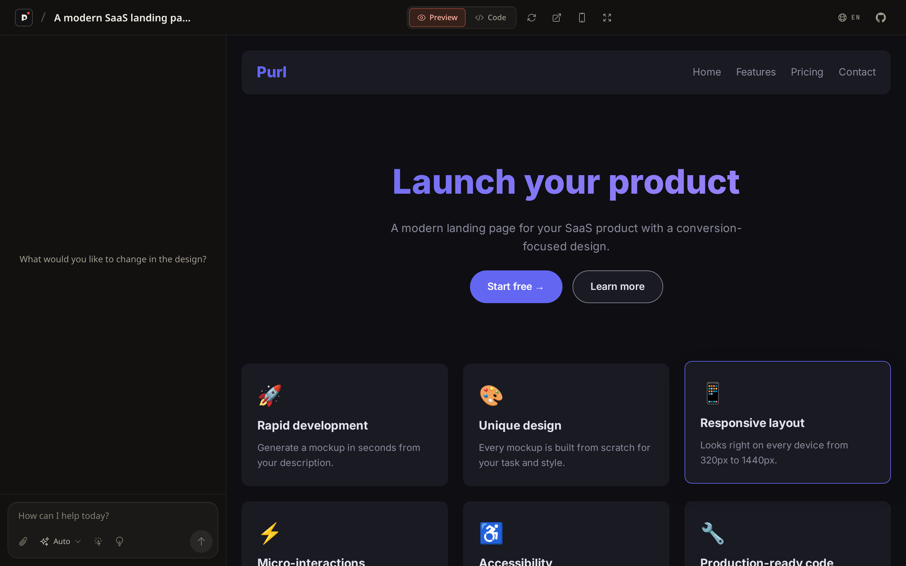
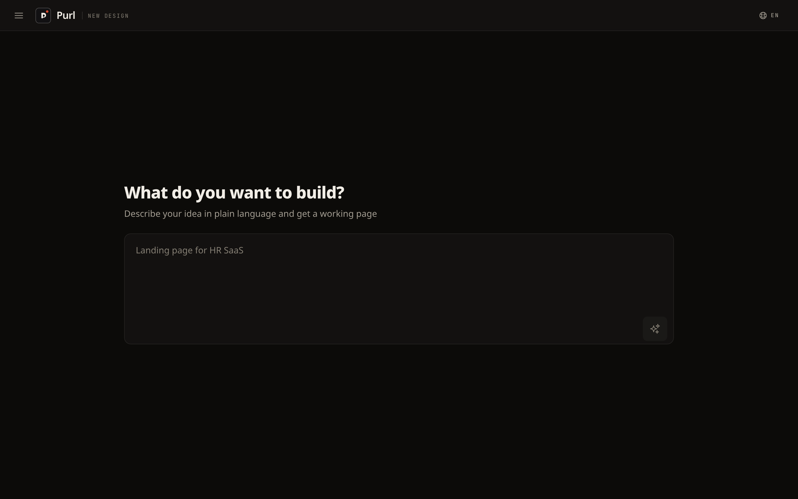
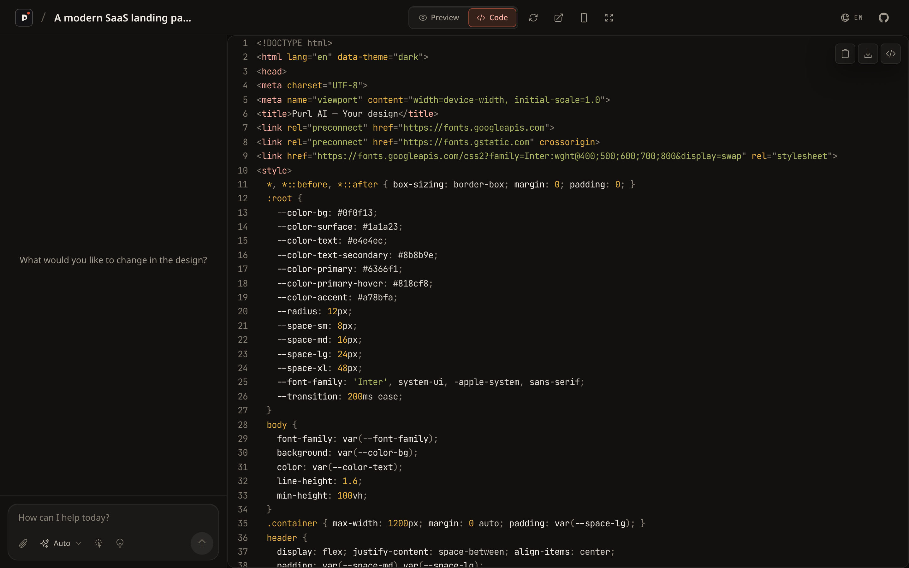
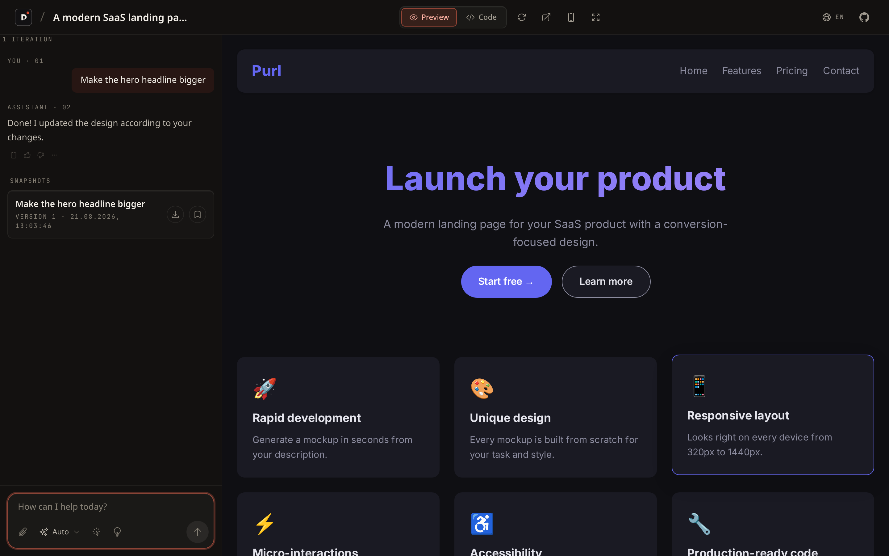

# Purl

**🌐 Language:** English | [Русский](README.ru.md)

Open-source AI design generator. Type a prompt, get a complete HTML/CSS/JS page, streamed live and previewed in a sandboxed iframe. Iterate on it in a chat until it's right. Similar in spirit to Vercel v0 and Lovable, but self-hostable.

[](https://github.com/lwakis/purl/actions/workflows/ci.yml)
[](https://github.com/lwakis/purl/releases)
[](https://github.com/lwakis/purl/stargazers)
[](https://github.com/lwakis/purl/commits/main)


## Contents

[Screenshots](#screenshots) · [Quickstart](#quickstart) · [How it works](#how-it-works) · [Architecture](#architecture) · [Tech stack](#tech-stack) · [Project structure](#project-structure) · [Environment variables](#environment-variables) · [API overview](#api-overview) · [Testing](#testing-and-linting) · [Troubleshooting](#troubleshooting) · [FAQ](#faq) · [Contributing](#contributing) · [Roadmap](#roadmap) · [Security](#security) · [License](#license)

Design at the speed of thought. Purl turns a plain-text description into a working web page: a landing page, a dashboard, a signup form, a pricing page. The backend assembles a system prompt, streams the generation to the browser over Server-Sent Events, and the frontend renders the result in a sandboxed iframe. Keep refining it in a chat — projects autosave as you work, and every iteration is stored in a version history.

<p align="center">
  
</p>

Flagship features:

- **Prompt to page.** Describe what you want and get complete, self-contained HTML with inline CSS and JS. Live preview, syntax-highlighted source, copy and download.
- **Iterate by chat.** "Make the buttons bigger", "switch to a dark theme". Purl rewrites the page and the preview updates.
- **Projects with autosave.** Work is saved automatically, like chats in AI assistants — no Save button. Projects keep a version history you can roll back.
- **Your model, your context.** Pick a provider and model from a catalog (`GET /api/models`), ask for a plan before code, attach up to 8 images (5 MB each), or click an element in the preview to iterate on it.
- **Mock mode.** With no LLM API key configured, Purl still works end to end. Great for local development, CI, and demos.

## Screenshots

| Landing | Code view |
|---|---|
|  |  |

Iterate by chat — every change becomes a restorable version snapshot:



## Quickstart

### Docker

```bash
git clone https://github.com/lwakis/purl.git && cd purl
docker compose up --build
```

Then open: frontend at http://localhost:5173, backend at http://localhost:8000 (health check at `/health`, Swagger docs at `/docs`).

No API key required. Leave `LLM_API_KEY` empty and the backend runs in mock mode, generating a local HTML design without any external calls.

### Local development

Backend (Python >= 3.13 and [uv](https://docs.astral.sh/uv/)):

```bash
cd backend
cp .env.example .env
uv sync --extra dev
uv run uvicorn app.main:app --reload --port 8000
```

Frontend (Node.js >= 22 with npm):

```bash
cd frontend
npm install
npm run dev
```

The Vite dev server runs on port 5173 and proxies `/api` to http://localhost:8000, so the frontend works as-is. See [backend/.env.example](backend/.env.example) for all configuration options.

## How it works

You type a prompt. The backend appends theme and style instructions to a curated system prompt, streams the request to a configured LLM provider (OpenAI-compatible endpoints or Anthropic — see presets below), and relays the response to the browser as Server-Sent Events. The frontend accumulates the streamed HTML and renders it in a sandboxed iframe (`sandbox="allow-scripts allow-popups allow-popups-to-escape-sandbox"`, no `allow-same-origin`), so generated code can never touch the host page. When you ask for changes, the chat history and current code are sent back and the cycle repeats.

## Architecture

```
┌──────────────────────────────┐
│        Frontend (React)      │
│ prompt · preview iframe ·    │
│ chat · code · projects       │
└──────────────┬───────────────┘
               │ HTTP + SSE (JSON)
┌──────────────▼────────────────┐
│      Backend (FastAPI)        │
│ /api/generate · /api/iterate  │
│ /api/projects · /api/templates│
└───┬────────────────────┬──────┘
    │                    │
┌───▼────────┐  ┌────────▼─────────┐
│   SQLite   │  │     LLM          │
│ (aiosqlite)│  │   provider:      │
│   projects │  │  OpenAI-compl. · │
│  versions  │  │   Anthropic      │
└────────────┘  └──────────────────┘
in-memory: rate limiter · TTL cache
```

## Tech stack

| Layer | Technology |
|---|---|
| Frontend | React 19, TypeScript 7, Vite 8, Tailwind CSS, zustand, react-syntax-highlighter |
| Backend | Python >= 3.13, FastAPI, SQLAlchemy 2 (async), uvicorn |
| Database | SQLite via aiosqlite |
| Streaming | Server-Sent Events (SSE) |
| LLM | Multi-provider: OpenAI-compatible presets (OpenAI, OpenRouter, Groq, DeepSeek, Gemini, Ollama) + Anthropic, with mock-mode fallback |
| Tooling | ruff, pytest, vitest, pre-commit, Docker Compose |

## Project structure

```
purl/
├── backend/                 # FastAPI service
│   ├── app/
│   │   ├── main.py          # entry point, CORS, health checks
│   │   ├── config.py        # pydantic-settings configuration
│   │   ├── database.py      # async SQLAlchemy engine + ORM models
│   │   ├── models.py        # request/response schemas
│   │   ├── prompts.py       # LLM system prompt
│   │   ├── routers/         # generate, projects, templates
│   │   └── services/        # LLM client, prompt builder, cache, rate limiter
│   ├── tests/               # pytest + pytest-asyncio
│   ├── .env.example         # environment template
│   └── pyproject.toml       # deps, ruff and pytest config
├── frontend/                # React SPA (Vite)
│   ├── src/
│   │   ├── components/      # topbar, preview, code, chat, sidebar, prompt
│   │   ├── hooks/           # generation and project hooks
│   │   ├── i18n/            # ru/en translations
│   │   ├── services/        # API client and SSE reader
│   │   ├── store/           # zustand state
│   │   ├── styles/          # global CSS
│   │   ├── test/            # vitest setup and helpers
│   │   └── types/           # shared TypeScript types
│   ├── e2e/                 # Playwright smoke tests
│   └── package.json
├── .github/workflows/       # CI (lint + tests)
├── LICENSE                  # MIT
├── docker-compose.yml       # one-command startup
└── .pre-commit-config.yaml  # lint and format hooks
```

## Environment variables

All variables are optional; defaults live in `backend/app/config.py`. Copy `backend/.env.example` to `backend/.env` and adjust.

| Variable | Default | Description |
|---|---|---|
| `LLM_API_KEY` | *(empty)* | LLM API key. Empty enables mock mode. |
| `LLM_PROVIDER` | `openai` | Preset: `openai`, `openrouter`, `groq`, `deepseek`, `gemini`, `ollama`, `anthropic`, or `custom` |
| `LLM_BASE_URL` | *(preset)* | Override provider base URL (required for `custom`) |
| `LLM_MODEL` | *(preset)* | Override model (required for `custom`) |
| `LLM_TEMPERATURE` | `0.7` | Sampling temperature |
| `LLM_MAX_TOKENS` | `8192` | Max tokens per response |
| `DATABASE_URL` | `sqlite+aiosqlite:///./purl.db` | Async SQLAlchemy database URL |
| `RATE_LIMIT_PER_HOUR` | `100` | Requests per hour per client IP |
| `CORS_ORIGINS` | `["http://localhost:5173","http://localhost:5174","http://127.0.0.1:5173","http://127.0.0.1:5174"]` | Allowed CORS origins (JSON array) |
| `MAX_PROMPT_LENGTH` | `2000` | Maximum prompt length in characters |
| `CACHE_TTL_SECONDS` | `86400` | Result cache TTL in seconds |

### Frontend

Frontend env vars are read at build time (`.env` in `frontend/`, see [frontend/.env.example](frontend/.env.example)).

| Variable | Default | Description |
|---|---|---|
| `VITE_API_BASE_URL` | *(empty)* | API base URL for fetch/SSE calls. Empty = same origin as the frontend (Vite dev proxy or reverse proxy in production). Set it only when frontend and backend live on different origins. |

## API overview

Interactive docs are served at `/docs` when the backend is running (FastAPI Swagger UI).

| Method | Path | Description |
|---|---|---|
| GET | `/api/models` | List available LLM providers and their models |
| POST | `/api/generate` | Generate a design; returns an SSE stream |
| POST | `/api/iterate` | Iterate on existing code via chat; SSE stream |
| GET | `/api/projects` | List projects (optionally filtered by `session_id`) |
| POST | `/api/projects` | Create a project |
| GET | `/api/projects/{id}` | Get a project |
| PUT | `/api/projects/{id}` | Update a project |
| DELETE | `/api/projects/{id}` | Delete a project and its versions |
| GET | `/api/projects/{id}/versions` | List versions, newest first |
| POST | `/api/projects/{id}/versions` | Save a new version |
| GET | `/api/projects/{id}/versions/{version_id}` | Get one version |
| GET | `/api/templates` | List starter templates (8, auto-seeded) |
| GET | `/health` | Health check |

### SSE event flow

`/api/generate` streams `data:` frames of JSON:

```
analysis → design → code → complete
```

- `analysis` and `design`: progress messages.
- `code`: chunks of the generated HTML as they arrive.
- `complete`: the final full HTML document.
- `error`: something went wrong.

## Testing and linting

```bash
# Backend (from backend/)
uv run pytest           # run the test suite
uv run ruff check .     # lint
uv run ruff format .    # format

# Frontend (from frontend/)
npx vitest run          # run the test suite
npm run build           # type-check (tsc -b) and build
npm run test:e2e        # end-to-end smoke tests (Playwright), auto-starts
                        # backend (mock mode) + Vite on :8000/:5173
                        #   first run: npx playwright install chromium

# Repo root
pre-commit install             # once, to enable hooks
pre-commit run --all-files     # run all hooks
```

## Troubleshooting

**Opening the app from another device on your network fails.**
By default CORS only allows `localhost` origins. Add the origin you open the app from to `CORS_ORIGINS` in `backend/.env` (for example `["http://192.168.1.10:5173"]`) and restart the backend.

**Port 5173 or 8000 is already in use.**
Free the port or pick another one: Vite — `npm run dev -- --port 5174` (then update CORS), backend — `--port 8001` (then set `VITE_API_BASE_URL=http://localhost:8001`). With Docker, remap ports in `docker-compose.yml`.

**I want to reset everything and start fresh.**
Local dev: stop the backend and delete `backend/purl.db`. Docker: `docker compose down -v` removes the `purl-data` volume along with the database.

**Generation fails instantly even though the backend is up.**
Check the backend log. A 429 response means you hit the rate limit (`RATE_LIMIT_PER_HOUR`, default 100 requests/hour per IP). With a real API key configured, provider errors surface as an error message in the chat.

## FAQ

**Do I need an LLM API key?**
No. Without a key Purl runs in mock mode and still generates real pages locally — great for trying it out, demos, and CI. Add a key when you want production-quality results from a live model.

**Where does my data go?**
Only where you point it. Purl is self-hosted: projects and versions live in your local SQLite file, and prompts are sent exclusively to the LLM provider you configure. No telemetry.

**Can I use it commercially?**
Yes — Purl is MIT licensed, and the pages it generates are yours.

**How is this different from Vercel v0 or Lovable?**
Those are hosted services; Purl is the self-hosted take: run it on your own machine, bring your own provider and keys, keep your data. The trade-off is that there is no hosted convenience.

**Which providers and models are supported?**
Any OpenAI-compatible endpoint through presets (OpenAI, OpenRouter, Groq, DeepSeek, Gemini, Ollama), plus Anthropic, plus a `custom` preset for arbitrary OpenAI-compatible base URLs. See the environment variables table above.

## Contributing

Bug reports, feature ideas, and pull requests are welcome. Please read [CONTRIBUTING.md](CONTRIBUTING.md) first: it covers setup, commit conventions, and the PR checklist. All community interactions follow our [Code of Conduct](CODE_OF_CONDUCT.md).

## Roadmap

The MVP is shipped: generation, streaming, preview, chat, projects with autosave and versions, and mock mode. Next up is export formats and additional open-source growth items. See [ROADMAP.md](ROADMAP.md) for the full plan. Release history lives in [CHANGELOG.md](CHANGELOG.md).

## Security

We take security seriously, especially because generated JavaScript is executed in the browser. Please report vulnerabilities privately, never in a public issue. See [SECURITY.md](SECURITY.md) for details.

## License

[MIT](LICENSE) © 2026 Purl AI contributors.
